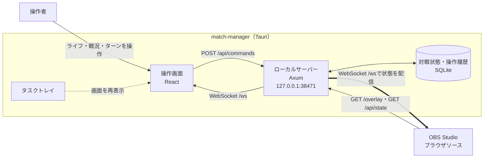

# match-manager

「鳴潮：対決」のライフ・戦況・ターンを管理するWindowsアプリです。

配布名は `wuwa-tcg-match-manager` です。

OBSオーバーレイは対戦状況を配信・録画に表示するための追加機能です。

## 利用方法

1. Releaseから `wuwa-tcg-match-manager_0.1.4_x64-setup.exe` をダウンロードしてインストールします。
2. match-managerを起動し、操作画面でライフ・戦況・ターンを管理します。「新しい対戦」でリセットし、「Undo」で直前の操作を戻せます。
3. 対戦管理だけならOBS Studioのインストールや設定は不要です。対戦状態と操作履歴はPC内に保存されます。

### OBSオーバーレイを使う場合

match-managerを起動した状態で「OBS URL」をコピーし、OBS Studioのブラウザソースに設定します。
URLは `http://127.0.0.1:38471/overlay` です。操作画面で変更した対戦状況が表示へ反映されます。

## ライセンス

`apps/match-manager/` 内の自作コードは[MITライセンス](LICENSE)で公開しています。
第三者の素材・依存ライブラリには、それぞれのライセンスが適用されます。
使用しているLucideアイコンの表記は[第三者ライセンス表記](../../THIRD_PARTY_NOTICES.md)を参照してください。


## 対戦管理とOBSオーバーレイの仕組み



1. Windowsアプリを起動すると、PC内だけで使うローカルサーバーが`127.0.0.1:38471`で待ち受けます。
2. 操作画面からライフ、戦況、ターンを変更すると、HTTP API経由でSQLiteへ保存されます。
3. 更新後の状態はWebSocketで操作画面へ配信されます。OBSオーバーレイを接続している場合は、OBS表示にもリアルタイムに反映されます。
4. OBS機能を利用する場合、ブラウザソースとして`http://127.0.0.1:38471/overlay`を表示します。対戦管理・OBS表示とも外部のWebサービスやインターネット接続は使用しません。

操作画面を閉じるとアプリ全体が終了し、タスクトレイのアイコンも消えます。ローカルサーバーも停止するため、OBSオーバーレイへ接続できなくなります。タスクトレイの「終了」からもアプリを終了できます。

対戦状態と操作履歴は、進行中の対戦を含む直近50戦までSQLiteに保存します。「対戦リセット」で次の対戦が始まると、上限を超えた古い対戦の履歴を確認なしで自動削除します。
既存の履歴もアプリ起動時に同じ上限で整理され、削除された対戦には「元に戻す」で戻れません。状態が変わらないリセットは新しい対戦として数えません。

## 採用技術

| 区分           | 技術                                | 役割                                          |
| -------------- | ----------------------------------- | --------------------------------------------- |
| デスクトップ   | Tauri 2                             | Windowsウィンドウ、トレイ、NSISインストーラー |
| フロントエンド | React、TypeScript、Vite             | 操作画面とOBS表示画面                         |
| UI状態         | Zustand                             | クライアント側の表示状態                      |
| 多言語         | i18next、react-i18next              | 日本語・英語・簡体中国語                      |
| HTTP/WebSocket | Axum、Tokio                         | ローカルサーバーとリアルタイム配信            |
| 永続化         | SQLite、rusqlite                    | 対戦状態と操作履歴                            |
| ログ           | tracing                             | 診断ログ                                      |
| テスト         | Vitest、Testing Library、Playwright | 単体・画面テスト                              |

## 開発環境

- Windows 10またはWindows 11
- Node.js 24
- pnpm 11
- Rust 1.98.1（MSVCツールチェーン）
- Microsoft C++ Build Tools
- Microsoft Edge WebView2 Runtime

Node.jsとRustのバージョンは、リポジトリ直下の`.node-version`と`rust-toolchain.toml`で固定しています。

## セットアップ

リポジトリのルートで実行します。

```powershell
pnpm install --frozen-lockfile
```

## 開発

Web UIだけを起動する場合:

```powershell
pnpm match-manager:dev
```

Tauriアプリとして起動する場合:

```powershell
pnpm match-manager:tauri:dev
```

## 検証

```powershell
pnpm match-manager:check
pnpm match-manager:e2e
pnpm match-manager:rust:format
pnpm match-manager:rust:check
pnpm match-manager:tauri:check
```

`match-manager:tauri:check`はデバッグ実行ファイルまでビルドしますが、インストーラーは生成しません。

## 配布ビルド

```powershell
pnpm match-manager:tauri:build
```

NSISインストーラーは`apps/match-manager/src-tauri/target/release/bundle/nsis`へ生成されます。
ファイル名は `wuwa-tcg-match-manager_<バージョン>_x64-setup.exe`（現在は `wuwa-tcg-match-manager_0.1.4_x64-setup.exe`）です。
Tauriの `productName` に配布名を設定し、ローカルビルドとReleaseの両方でアプリ名を含むインストーラーを生成します。

## Windows向けリリース

`.github/workflows/match-manager-release.yml`は`match-manager-v1.2.3`形式のタグがpushされると、Windows x64向けNSISインストーラーをビルドし、タグと同名のGitHub Releaseをドラフトとして作成します。インストーラーを確認してからReleaseを公開してください。タグのバージョンは`apps/match-manager/package.json`、`apps/match-manager/src-tauri/tauri.conf.json`、`apps/match-manager/src-tauri/Cargo.toml`と一致させます。

例えば現在のバージョンを配布する場合は、変更をmainへ反映した後、次を実行します。

```powershell
git tag match-manager-v0.1.4
git push origin match-manager-v0.1.4
```

WebView2 Runtimeがない環境では、Tauriのインストーラーが導入時に取得します。

現時点ではコード署名を設定していません。
