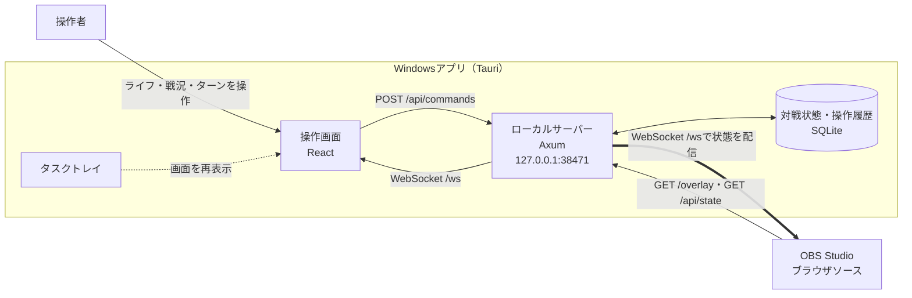

# OBSオーバーレイ開発環境

対戦管理用のWindowsアプリとOBSブラウザソースを、Tauri 2、React、TypeScript、Rustで構築します。

## オーバーレイの仕組み



1. Windowsアプリを起動すると、PC内だけで使うローカルサーバーが`127.0.0.1:38471`で待ち受けます。
2. 操作画面からライフ、戦況、ターンを変更すると、HTTP API経由でSQLiteへ保存されます。
3. 更新後の状態はWebSocketで操作画面とOBSへ同時配信されるため、OBS表示がリアルタイムに切り替わります。
4. OBSはブラウザソースとして`http://127.0.0.1:38471/overlay`を表示します。外部のWebサービスやインターネット接続は使用しません。

操作画面を閉じてもアプリはタスクトレイで動作し続けるため、OBSへの配信は継続します。タスクトレイからアプリを終了するとローカルサーバーも停止し、OBSオーバーレイへ接続できなくなります。

## 採用技術

| 区分           | 技術                                | 役割                                          |
| -------------- | ----------------------------------- | --------------------------------------------- |
| デスクトップ   | Tauri 2                             | Windowsウィンドウ、トレイ、NSISインストーラー |
| フロントエンド | React、TypeScript、Vite             | 操作画面とOBS表示画面                         |
| UI状態         | Zustand                             | クライアント側の表示状態                      |
| 多言語         | i18next、react-i18next              | 日本語・英語・簡体中国語                      |
| HTTP/WebSocket | Axum、Tokio                         | ローカルサーバーとリアルタイム配信            |
| 永続化         | SQLite、rusqlite                    | 対戦状態と操作履歴                            |
| ログ           | tracing                             | 診断ログ                                      |
| テスト         | Vitest、Testing Library、Playwright | 単体・画面テスト                              |

## 必要環境

- Windows 10またはWindows 11
- Node.js 24
- pnpm 11
- Rust 1.98.1（MSVCツールチェーン）
- Microsoft C++ Build Tools
- Microsoft Edge WebView2 Runtime

Node.jsとRustのバージョンは、リポジトリ直下の`.node-version`と`rust-toolchain.toml`で固定しています。

## セットアップ

リポジトリのルートで実行します。

```powershell
pnpm install --frozen-lockfile
```

## 開発

Web UIだけを起動する場合:

```powershell
pnpm overlay:dev
```

Tauriアプリとして起動する場合:

```powershell
pnpm overlay:tauri:dev
```

## 検証

```powershell
pnpm overlay:check
pnpm overlay:e2e
pnpm overlay:rust:format
pnpm overlay:rust:check
pnpm overlay:tauri:check
```

`overlay:tauri:check`はデバッグ実行ファイルまでビルドしますが、インストーラーは生成しません。

## 配布ビルド

```powershell
pnpm overlay:tauri:build
```

NSISインストーラーは`apps/overlay/src-tauri/target/release/bundle/nsis`へ生成されます。
