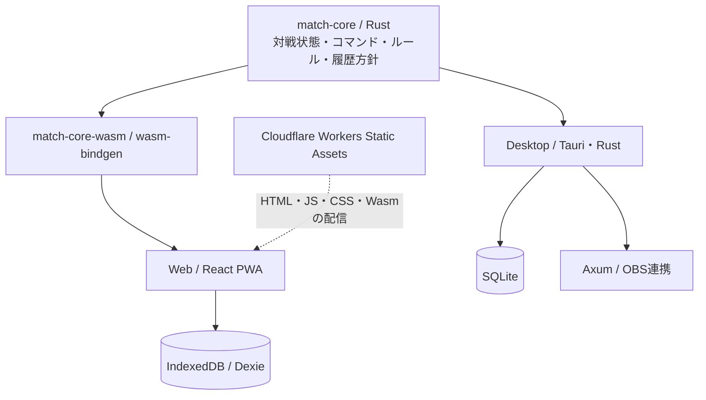

# Match Manager PWAの技術スタックとホスティング

- 決定日: 2026-10-01
- 状態: 採用（工程1〜4を実装、PWA化・公開は未着手）
- 開発ブランチ: `codex/match-manager-pwa-architecture`

## 目的と初期スコープ

スマートフォン1台で両プレイヤーのライフ、戦況、ターンを管理するPWAを提供する。
Undo、対戦リセット、再起動後の復元を含め、初回読み込みとオフライン用資産の保存完了後は通信なしで使えるようにする。
WebにはOBS連携を含めない。ログイン、クラウド保存、端末間同期、対戦ルームは初期スコープに含めない。

DesktopとWebは同じ対戦ルールを使用し、保存先と実行環境を分離する。
両者の保存データはそれぞれ独立しており、共通コアを使うこと自体は同期を意味しない。

## 採用技術

| 領域             | 採用技術                                              | 選定理由                                                             |
| ---------------- | ----------------------------------------------------- | -------------------------------------------------------------------- |
| 共通の対戦コア   | Rustの独立crate                                       | 既存の対戦ロジックを移し、DesktopとWebで単一の実装を使える           |
| ブラウザ向けコア | WebAssembly、wasm-bindgen、wasm-pack                  | Rustコアをブラウザで実行する薄いアダプターを生成できる               |
| 画面             | React、TypeScript、Vite                               | 既存のコンポーネントと開発環境を再利用できる                         |
| UIの状態管理     | Zustand                                               | 保存・実行アダプターから受け取った状態を画面に反映する               |
| Webの永続化      | IndexedDB、Dexie                                      | 非同期トランザクション、履歴の検索、スキーマのバージョン管理を扱える |
| PWA              | vite-plugin-pwa、Workbox（generateSW）                | Manifest、オフライン用キャッシュ、更新通知をViteのビルドに組み込める |
| Desktop          | 現行のTauri、Rust、SQLite、Axum                       | 保存先とOBS用のHTTP/WebSocketをDesktop側に残せる                     |
| 検証             | Rustの単体テスト、Vitest、Testing Library、Playwright | 対戦ルール、UI、保存・復元、オフライン動作を段階ごとに検証できる     |
| パッケージ管理   | 現行のpnpm workspace                                  | 既存リポジトリ内でWebアプリと共有UIを管理できる                      |
| ビルド・配布     | GitHub Actions、Wrangler                              | Rust/WasmとWebを同じCIでビルドし、静的成果物を配信できる             |
| ホスティング     | Cloudflare Workers Static Assets                      | HTTPSで静的PWAを配信でき、対戦用バックエンドを必要としない           |

Reactなど既存の依存バージョンは原則維持する。新規依存の具体的なバージョンは導入時に互換性を確認してロックする。
特に既存Viteとのvite-plugin-pwaの互換性、Rustツールチェーンとwasm-pack/wasm-bindgenの組み合わせは、最初の実証ビルドで確認する。

## 共通コアの境界



既存の `apps/match-manager/src-tauri/src/match_state.rs` を切り出しの出発点とする。
ここには初期ライフ、ライフの範囲、戦況、ターン進行、アクションの状態遷移が既に実装されている。
一方、Undoと直近50戦の履歴保持は現状 `match_store.rs` にあるため、状態遷移だけを切り出して共通化完了とはしない。

共通コアには次を置く。

- 対戦状態、コマンド、入力の検証、初期値、状態遷移。
- Undoで復元する状態とrevisionの更新規則。
- 状態が変化しないコマンドでは履歴を増やさない規則。
- リセットが新しい対戦になる条件と、進行中を含む直近50戦の保持方針。
- 保存データの検証と、Desktop/Webで共有するシリアライズ契約。

コアはDB、HTTP、WebSocket、React、Tauri、ブラウザAPIに依存しない。
Undoの復元候補や履歴削除境界を計算する純粋な関数を提供し、履歴の読込・書込は保存アダプターが担当する。
SQLiteの既存スキーマと履歴を維持できる形で移行し、DB構造をWebに合わせて作り直すことはしない。

コマンド処理では、候補状態を計算し、状態と履歴を同一トランザクションで保存した後にUIへ反映する。
保存失敗時に画面だけ先に進むことを防ぐ。Webの連続タップはキューで直列処理する。
複数タブの同時操作は、IndexedDBトランザクション内で最新状態を読み、revisionを照合し、他の画面にも変更を通知する。

WebAssemblyの境界は、まず既存のJSON契約を受け渡す薄いラッパーにする。
コマンドや状態のTypeScript型はRust契約からの生成を検討し、少なくとも契約テストでズレを検出する。
revisionのRust `u64` とJavaScriptの安全な整数範囲の違いも、境界で明示的に検証する。
Rustのpanicで通常の入力エラーを処理せず、検証エラーを結果として返す。

### 共通コア方式の比較

| 方式                                               | 評価                                                                 |
| -------------------------------------------------- | -------------------------------------------------------------------- |
| RustコアをDesktopで直接利用し、WebでWasmとして利用 | 採用。既存ロジックとテストを活かし、両環境のルールを一本化できる     |
| TypeScriptへコアを移す                             | Webは簡単になるが、DesktopのRustサーバーとの責務を作り直す必要がある |
| RustとTypeScriptで同じルールを別々に実装           | 更新のたびに差分が生じるため採用しない                               |

Wasmには追加のビルド工程、初期化、キャッシュ管理が必要になる。
今回の採用理由は計算速度ではなく、既存のRust実装を共通利用できることにある。
最初に小さな実証で、iPhone/Androidでの読込・操作・オフライン起動とビルド手順を確認する。

## ディレクトリ構成（実装時の予定）

```text
crates/
  match-core/          # 純粋なRustの対戦ロジック
  match-core-wasm/     # ブラウザ向けの薄いラッパー
packages/
  match-ui/            # ライフ・戦況・ターンの共有Reactコンポーネント
apps/
  match-manager/       # 既存Desktopアプリ、SQLite、OBS連携
  match-manager-web/   # PWA、IndexedDB、Web向け操作・更新通知
```

共有UIにはDBや接続処理を入れず、値と操作コールバックを渡す。
DesktopのOBS URL、接続ステータスと、Webのオフライン準備・更新通知は各アプリの画面で扱う。
Webは既存の `127.0.0.1:38471` のAPIやWebSocketを呼ばない。

実装時にpnpm workspaceへ `packages/*` を追加し、Rust workspaceの範囲を決める。
既存のDesktopのビルド、リリース、ライセンス表記が維持されることも確認する。
共有部分とWebのライセンス表記は、切り出し時に対象ディレクトリを明記する。

## オフライン・保存・更新

Manifestには安定したid、start_url、scope、standalone表示、アイコンを設定する。
JS/CSSだけでなくWasm、アイコンなど起動に必要な資産をすべて同一オリジンで配信し、プリキャッシュ対象に含める。
外部CDNのランタイム読み込みに依存しない。
オフライン準備完了を表示し、それ以前の初回アクセスには通信が必要であることが分かるようにする。

更新方式は `registerType: 'prompt'` とし、対戦中に自動再読み込みしない。
更新を適用する前に保存処理の完了を待ち、DBのマイグレーションと旧キャッシュの整理を行う。
データが復元できない場合に、無言で初期状態へ上書きしない。
DBにはスキーマとコアのデータ形式のバージョンを持たせ、将来の更新を検証可能にする。

IndexedDBは端末・ブラウザ・オリジンごとの保存であり、永続保存の保証ではない。
保存容量不足や書込失敗を画面に表示する。`navigator.storage.persist()` は補助的に使用する。
履歴を長期保存したい場合のJSONエクスポート・インポートは後続機能とする。
本番オリジンを変更すると保存データは自動移行しないため、URLは初回公開前に固定する。

## ホスティングの決定

**Cloudflare Workers Static Assetsを採用する。**

Workersという名称でも、この構成ではサーバー側の対戦処理やWorkerスクリプトは作らない。
Viteで生成したHTML、JS、CSS、Wasm、Manifest、Service Workerを配信する。
Cloudflare公式資料では、静的資産へのリクエストは無料・無制限で、資産保存にも追加料金はない。
Workerスクリプト実行、ビルドサービス、独自ドメイン取得は別の条件なので、静的配信の料金と混同しない。

| 候補                             | 判断                                                                                                            |
| -------------------------------- | --------------------------------------------------------------------------------------------------------------- |
| Cloudflare Workers Static Assets | 採用。静的配信、ヘッダー設定、Wranglerからの配布を一つの環境で扱える                                            |
| Cloudflare Pages                 | PWAの配信は可能。今回はWorkers Static Assetsに配布先を統一する                                                  |
| GitHub Pages                     | 配信は可能。公開サイト1GB、月100GBのソフトな帯域上限があり、PWA用の配信ヘッダーを設定できるCloudflareを優先する |

初回公開にはCloudflareアカウント、配布先の作成、GitHub Actions用のAPIトークンが必要になる。
配布先の予定名は `wuwa-tcg-match-manager-web`。名前の利用可否と実際のURLは配布先作成時に確認する。
最初はHTTPSの `workers.dev` を利用できる。独自ドメインを使う場合は初回公開前に決める。
この決定ではアカウント作成、リソース作成、公開、ドメイン取得は実施していない。

### 配布手順の方針

1. GitHub Actionsで既存の固定Node/pnpm/Rustツールチェーンを用意する。
2. `wasm32-unknown-unknown` ターゲットを追加し、固定したwasm-packで `--target web` のバインディングを生成する。
3. 共通コア、Web、Desktopの関連チェックを実行し、Webをビルドする。
4. Wasmを含む `apps/match-manager-web/dist` をWranglerで配布する。
5. 本番配布は手動起動から始める。プレビュー配布は本番と別のオリジンで検証する。

Cloudflareで再ビルドせず、CIで検証した成果物をアップロードする。
HTML、Service Worker、Manifestには更新を確認できるキャッシュ設定を行い、ハッシュ付き資産は長期キャッシュする。
WasmのContent-Type、Service Workerのscope、HTTPSでのインストールとオフライン起動を配布後に確認する。
初期画面は単一URLとし、存在しないJS/Wasmへの要求にHTMLを返す過剰なSPAフォールバックは避ける。

## 実装順と完了条件

1. Rustコアを切り出し、Desktopで既存の対戦・Undo・履歴保存が維持されることを確認する。
2. Wasmラッパーと最小Web画面を作り、同じコマンド列でDesktop/Webの状態が一致することを確認する。
3. IndexedDBアダプターを実装し、保存・復元、Undo、50戦保持、連続操作、書込失敗を検証する。
4. UIを共有化し、スマホの縦画面、タッチ操作、セーフエリアに対応する。
5. PWAのキャッシュと更新通知を追加し、初回キャッシュ後の機内モード・再起動・更新後の状態復元を確認する。
6. GitHub ActionsとWranglerを設定し、本番URLを固定して公開する。

PlaywrightのChromium/WebKitに加え、Android ChromeとiPhone Safari・ホーム画面起動で実機確認する。
ブラウザの模擬モバイル表示だけをもって、iOSのPWA動作を確認済みとはしない。
工程1では `crates/match-core/` を実装し、Desktopからpath依存で利用する。
共有crateは `crates/Cargo.toml` のworkspaceで管理し、DesktopのCargoプロジェクト、lockfile、targetパス、release profileは維持する。
工程2では `crates/match-core-wasm/` と `apps/match-manager-web/` を実装する。
WasmラッパーはJSON契約とrevisionの安全な整数範囲を検証し、Webのメモリアダプターが履歴を管理する。
DesktopのSQLiteアダプターで生成した239コマンドの操作列と、ブラウザ内で動作するWasmの各状態を比較する。
工程2時点のDesktop UI直接参照は工程4で共有UIパッケージへ置き換えた。工程5以降とAndroid/iPhoneの実機検証は未着手。

工程2の検証結果: Rustの32テスト、Clippy、フォーマット・Webの型検査とLintを通過。
Edgeで239操作のDesktop/Web状態一致とWebの4テストを確認し、静的配布ビルドでも2テストを通過した。
Wasm読込失敗後の再試行、PC APIへ接続しない動作、再読み込み時の試作版の初期化を含む。

工程3ではメモリアダプターをIndexedDB/Dexieに置き換える。
DBスキーマと保存データ形式はバージョン1。現在状態・Undoのbaselineは `records`、操作後のスナップショットは `history` に保存する。
Wasm初期化はトランザクション開始前に行い、計算と保存は同一トランザクション内で実行する。
保存完了前にはUIを更新せず、no-opは履歴に追加しない。Undo・リセット・50戦境界の削除も原子的に保存する。
連続操作はキューに入れ、複数タブからの操作はトランザクション内で最新revisionを読んで計算する。
Dexie liveQueryで各画面へ更新を通知する。端末間のクラウド同期は行わない。
起動時に保存データと履歴を検証し、破損・未対応形式の場合はデータを変更せずエラーにする。
永続保存の許可要求は補助的に行う。保存APIが利用できない場合や容量不足を画面に表示し、保存されないメモリへの自動フォールバックはしない。

工程3の検証結果: Edgeで15テスト、静的配布ビルドで5テストを通過。
239操作のDesktop/IndexedDB状態一致、途中のDB再開、100回の連続操作、複数タブの同時操作を確認した。
容量不足、Undo・保持境界の削除失敗のロールバック、破損・新しいDB形式の保護、連続操作中の保存エラー表示も含む。
Webの型検査・Lint・フォーマット、Rustの14テストとClippyも通過した。

工程4では `packages/match-ui/` にライフ・戦況・ターンのReactコンポーネント、共通テーマ・レイアウト、JSON契約のTypeScript型を移した。
DesktopとWebはworkspace依存で利用し、保存処理、通信、OBSは各アプリに残す。共有UIの自作部分はMITライセンスとする。
Webでは縦画面でも両者のライフを横並びにし、ボタンのタッチ領域を44px以上に確保する。
`viewport-fit=cover` とセーフエリアの余白、縦スクロール、動きを減らす設定に対応する。
幅320・390・430pxのタッチ対応モバイル表示で、横へのはみ出し、連続タップ、Undo、保存・復元を検証する。
セーフエリアはCSS変数へ余白を注入してレイアウトを検証する。実機でのノッチ・ホームインジケーターの確認は未実施。

工程4の検証結果: 共有UI・Desktop・Webの型検査、Lint、フォーマットが通過した。
Desktopの7単体テスト・2ブラウザテスト、Webの21ブラウザテスト・静的配布ビルドの11テストが通過した。
DesktopとWebの配布ビルド、OBSオーバーレイの背景透過・読み取り専用表示も確認した。

### 2026-10-02: Webの検証をDesktopから独立させる

WebではDesktopとの動作一致を保証しない。通常のCIとWebリリースでは、Webの永続化E2Eと配布成果物のテストを実行する。
DesktopのSQLiteから比較データを生成するテストと生成コマンドを削除し、Webの検証からDesktop/Tauriのビルド依存を外す。
Wasmの不正入力拒否、IndexedDBの保存・復元・同時更新・ロールバック、操作画面とモバイル表示のテストは継続する。
上記のDesktop/Web比較結果は、方針変更前の各工程で実施した検証の記録として残す。

## 参照資料

2026-10-01に公式資料を確認した。利用料金・制限・対応バージョンは導入時にも再確認する。

- [wasm-pack buildと出力ターゲット](https://wasm-bindgen.github.io/wasm-pack/book/commands/build.html)
- [DexieとReact](https://dexie.org/docs/Tutorial/React)
- [Vite PWAの更新通知](https://vite-pwa-org.netlify.app/guide/prompt-for-update)
- [PWAのインストール要件](https://developer.mozilla.org/en-US/docs/Web/Progressive_web_apps/Guides/Making_PWAs_installable)
- [ブラウザの保存容量とデータ削除](https://developer.mozilla.org/en-US/docs/Web/API/Storage_API/Storage_quotas_and_eviction_criteria)
- [Cloudflare Workers Static Assets](https://developers.cloudflare.com/workers/static-assets/)
- [Static Assetsの料金と制限](https://developers.cloudflare.com/workers/static-assets/billing-and-limitations/)
- [GitHub Pagesの制限](https://docs.github.com/en/pages/getting-started-with-github-pages/github-pages-limits)
